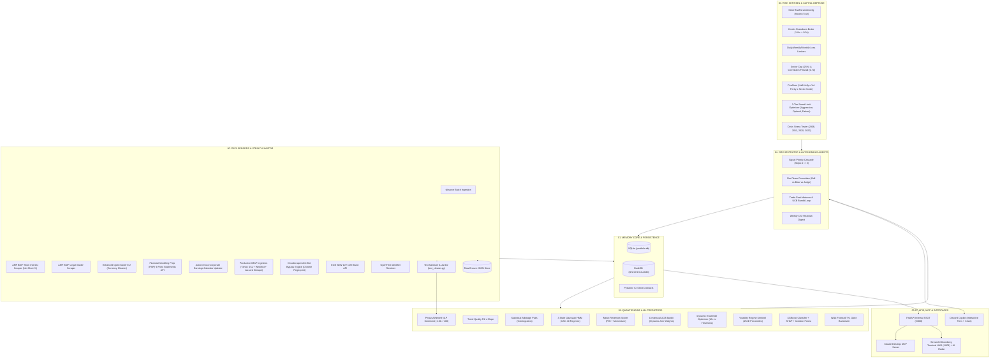

# PEA Pollux — Institutional Systematic Quantitative Terminal

> **Sovereign Execution · Continuous Kinetic Risk Sentinel · Adaptive Multi-Armed Bandit Brain · Absolute Transparency**
> 
> Institutional-grade, zero-leverage **Quantitative Recommendation & Decision Support Engine** specifically engineered for the French **PEA** (Plan d'Épargne en Actions).

The PEA Pollux platform ingests multi-source market quotes, macro spreads, insider filings, and bilingual financial news, computes multi-horizon quantitative alpha signals (Mean-Reversion Exhaustion, Statistical Arbitrage / Pairs Cointegration, Trend Quality $R^2 \times \text{slope}$, 3-State Gaussian HMM CAC 40 regimes), dynamically weighs alpha sub-models using a **Contextual Multi-Armed Bandit (UCB)** and **Dynamic Ensemble Optimizer**, evaluates continuous 252-day volatility percentile tiers, vets every candidate through an unyielding 7-stage risk cascade (including live Isolation Forest anomaly detection and XGBoost win probability scoring), and surfaces curated **Quantitative Recommendations** to the portfolio manager via a **Streamlit Bloomberg Terminal HUD**, a **FastAPI Central Engine (SSOT)**, and a **Claude Desktop Model Context Protocol (MCP) Server**.

**The system never executes broker orders autonomously.** Mathematical and statistical models generate data-backed recommendations; the human portfolio manager retains sovereign execution authority at all times.

---

[](https://github.com/Polluxgnr/Peatrading/actions/workflows/ci.yml)
[](https://fastapi.tiangolo.com)
[](https://modelcontextprotocol.io)
[](https://www.python.org/downloads/)
[](LICENSE)
[](https://huggingface.co/ProsusAI/finbert)

Repository: [github.com/Polluxgnr/Peatrading](https://github.com/Polluxgnr/Peatrading)

---

## 📑 Table of Contents

1. [Architecture & System Specifications](docs/ARCHITECTURE.md)
2. [Multi-Agent Blueprint & Roadmap](docs/MULTI_AGENT_BLUEPRINT_AND_ROADMAP.md)
3. [Core Philosophy & Recommendation Paradigm](#-core-philosophy--recommendation-paradigm)
4. [End-to-End System Architecture](#-end-to-end-system-architecture)
5. [Specialized Worker Federation](#-specialized-worker-federation)
6. [Quantitative Alpha Streams](#-quantitative-alpha-streams)
7. [Adaptive AI Brain & Continuous Volatility Tiers](#-adaptive-ai-brain--continuous-volatility-tiers)
8. [The 7-Stage Risk & Sizing Cascade](#-the-7-stage-risk--sizing-cascade)
9. [Autonomous Reinforcement Feedback Loop](#-autonomous-reinforcement-feedback-loop)
10. [Operator Interfaces & Command Center](#-operator-interfaces--command-center)
11. [Central API & Model Context Protocol (MCP)](#-central-api--model-context-protocol-mcp)
12. [Installation & Quickstart Guide](#-installation--quickstart-guide)
13. [Configuration Reference](#-configuration-reference)
14. [Makefile Command Reference](#-makefile-command-reference)
15. [LLM Context Dumps](#-llm-context-dumps)
16. [Verification & Test Suites](#-verification--test-suites)
17. [Institutional Disclaimer](#-institutional-disclaimer)

---

## 🏛️ Core Philosophy & Recommendation Paradigm

```
┌─────────────────────────────────────────────────────────────────────────────┐
│                      THE SOVEREIGN PM GOVERNANCE MODEL                      │
│                                                                             │
│   ┌───────────────────┐      ┌────────────────────┐      ┌──────────────┐   │
│   │ 00-04 Quant & ML  │ ───▶ │ 06 API / 07 MCP    │ ───▶ │ Human PM     │   │
│   │ Recommendation    │      │ Unified Data &     │      │ Sovereign    │   │
│   │ Engines           │      │ Recommendation Hub │      │ Execution    │   │
│   └───────────────────┘      └────────────────────┘      └──────────────┘   │
└─────────────────────────────────────────────────────────────────────────────┘
```

1. **Recommendation Paradigm (Sovereign Execution)**: The system evaluates data, computes risk-adjusted sizing, and outputs strictly structured *Recommendations*. The human portfolio manager makes the final trade decision and manually enters the order with their broker.
2. **Zero Fractional Shares (`math.floor`)**: Under French PEA regulations, only whole shares are permitted. Sizing algorithms round down strictly (`int(target_cash / price)`) — ensuring zero margin, zero leverage, and full compliance.
3. **Deterministic Math First, AI Second**: Machine learning and LLMs never replace quantitative risk models. Quantitative equations enforce hard constraints; NLP transformers (`ProsusAI/finbert`) score sentiment; generative LLMs provide qualitative narrative summaries and adversarial Red Team debates.
4. **Multi-Tier Institutional Data Memory**:
   - **Bronze Layer**: Partitioned raw JSON payloads (`database/raw_bronze/{source}/{YYYY-MM-DD}/`) eliminating survivorship bias.
   - **Silver Layer**: Vectorized DuckDB parquet timeseries (`daily_ohlcv`).
   - **Gold Layer**: SQLite audit logs, portfolio positions, equity curve history, and feature snapshots (`lineage_json`) enabling full offline ML replay.
5. **Continuous Kinetic Risk Management**: Capital preservation is enforced through multi-horizon loss circuit breakers (**Daily −0.5%, Weekly −2.0%, Monthly −5.0%**) and a continuous **Kinetic Brake** ($1.0\times \to 0.50\times \to 0.20\times \to 0.0\times$) that dynamically scales position sizing based on peak-to-trough drawdown.
6. **Decision Funnel Transparency**: Every signal rejected by the risk cascade is immutably classified and logged with its exact mathematical veto reason (VIX panic, macro blackout, Piotroski score, correlation, sector cap, ADV liquidity, ML probability veto).

---

## 📐 End-to-End System Architecture



---

## 🤖 Specialized Worker Federation

The engine is organized into independent, decoupled workers:

| Worker Module | Responsibility | Primary Classes / Functions |
|---|---|---|
| **Data Steward & Stealth Janitor** (`00_data_sensors`) | Ingests market quotes, resolves FIGI/ISIN, bypasses anti-bot/Cloudflare challenges via `cloudscraper`, ingests overnight IMAP newsletters, queries FMP for 9-point Piotroski statements, scrapes AMF BDIF net short positions ($>3\%$), and synchronizes corporate earnings calendars. | `MarketPricesAPI`, `FundamentalsSensor`, `MacroAlphaSensor`, `safe_get`, `amf_short_scraper.py`, `earnings_updater.py`, `imap_ingest/`, `clean_financial_text`, `OpenInsiderEuScraper` |
| **Memory Core & Gateways** (`01_memory_core`) | Manages SQLite thread-safe transactions, DuckDB timeseries tables, and immutable audit logs with lineage serialization. | `PortfolioDB`, `TimeSeriesDB`, `data_models.py` |
| **Quant Strategy Workers** (`02_quant_engine`) | Computes technical setups, cointegrated pairs, CAC 40 HMM market regimes, FinBERT sentiment, dynamic UCB bandit weights, dynamic ML ensemble weighting, and ML win probabilities with SHAP explainability. | `SignalGenerator`, `StatArbEngine`, `HMMRegimeClassifier`, `NewsSentimentScorer`, `UCBBandit`, `DynamicEnsemble`, `VolatilityRegimeSentinel`, `WalkForwardBacktester`, `ml_trainer.py` |
| **Risk Sentinel & Execution Tiers** (`03_risk_portfolio`) | Enforces Pydantic strict parameter validation, drawdown circuit breakers, kinetic exposure scaling, proportional sector rescaling, and 3-tier ATR limit order pricing (Aggressive, Optimal, Patient). | `RiskParamsConfig`, `DrawdownBreaker`, `CorrelationFirewall`, `PeaSizer`, `calculate_smart_limit_price`, `StressTester` |
| **Decision Orchestrator & AI Judges** (`04_orchestrator_ai`) | Executes the 7-stage veto cascade, conducts Red Team debates, generates CIO reports, and updates the contextual bandit reinforcement loop. | `SignalOrchestrator`, `RedTeamDebateAgent`, `TradePostMortemEngine`, `WeeklyHistorian` |
| **Interface & Visual HUD** (`05_interfaces`) | Renders the Bloomberg-style Streamlit terminal, consuming FastAPI endpoints, interactive decision funnel waterfalls, AI strategy weight radar charts (`line_polar`), trade cards, and Discord copilot. | `terminal_dashboard.py`, `trade_cards.py`, `discord_copilot.py` |
| **Central API (SSOT)** (`06_api`) | Single Source of Truth FastAPI service exposing portfolio state, pending recommendations, health metrics, funnel analytics, and backtest runners. | `internal_api.py` |
| **MCP Server** (`07_mcp`) | Model Context Protocol gateway enabling Claude Desktop and external LLMs to query live portfolio status and quantitative recommendations. | `pollux_mcp.py` |

---

## 🔬 Quantitative Alpha Streams

### 1. Core Allocation — Smart DCA Engine
- **Core Instrument**: Amundi MSCI World PEA ETF (`CW8.PA` / `EWLD.PA`), targeted at **70–75%** of total portfolio equity.
- **Smart DCA Regime Rule**:
  - When $P_{\text{core}} < \text{SMA}_{200}$ (market crisis/drawdown): The engine triggers aggressive accumulation tranches to lower average entry cost.
  - When $P_{\text{core}} \ge \text{SMA}_{200}$ (standard uptrend): The engine applies standard disciplined DCA tranches.

### 2. Tactical Satellite Mean-Reversion Exhaustion (MRE)
A satellite BUY signal is triggered if and only if all technical conditions are simultaneously satisfied:
$$\text{BUY} \iff (P > \text{SMA}_{200}) \land (\text{RSI}_{14} < 30.0) \land (P > \text{SMA}_5) \land (\text{Trend Quality} \ge 0.20) \land (\text{EPS} > 0)$$
- **Trend Filter**: $P > \text{SMA}_{200}$ ensures stock picking occurs strictly within macro secular uptrends.
- **Exhaustion Trigger**: $\text{RSI}_{14} < 30.0$ identifies short-term oversold capitulation.
- **Momentum Gate**: $P > \text{SMA}_5$ prevents "falling knife" syndrome by requiring immediate short-term stabilization.
- **Trend Quality ($R^2 \times \text{slope}$)**: Filters out erratic or noisy price action.
- **Quality Factor**: Trailing EPS $> 0$ eliminates speculative, unprofitable companies.

### 3. Market-Neutral Statistical Arbitrage & Pairs Trading Engine
- **Sector Isolation**: Cointegration tests are strictly bounded within the same industry sector (defined in `config/pea_universe.yaml`) to eliminate spurious mathematical correlations.
- **Engle-Granger Two-Step Cointegration**: Evaluates stationarity of residuals with $p\text{-value} < 0.05$.
- **OLS Spread & Rolling Z-Score**: Computes dynamic hedge ratio $\beta = \frac{\text{Cov}(P_A, P_B)}{\text{Var}(P_B)}$ and tracks 20-day rolling Z-score:
  $$Z_t = \frac{\text{Spread}_t - \mu_{20}}{\sigma_{20}}$$
- **Signal Triggers**:
  - $Z_t \le -2.0$: BUY Asset A (spread oversold, reversion expected).
  - $Z_t \ge +2.0$: SELL Asset A (spread overbought).
  - $|Z_t| \le 0.5$: Mean-reversion profit target achieved (EXIT).

### 4. 3-State Gaussian Hidden Markov Model (HMM)
- Classifies the Paris CAC 40 index (`^FCHI`) into distinct regimes:
  - **State 0 (BULL)**: Low volatility, positive drift.
  - **State 1 (BEAR)**: Moderate volatility, negative drift.
  - **State 2 (VOLATILE)**: High volatility shock regime (failsafe default on numerical uncertainty).

### 5. Institutional FinBERT Sentiment Engine
- Raw financial news strings are sanitized by the Data Janitor (`clean_financial_text`) stripping HTML entities, marketing disclaimers, and tracking links, truncated to 1500 characters.
- Evaluated offline by `ProsusAI/finbert` transformer pipeline, producing normalized scores in $[-100.0, +100.0]$.

### 6. Live Machine Learning Predictor Worker (XGBoost + SHAP + Isolation Forest)
- **Isolation Forest Anomaly Veto**: Evaluates multi-factor market state snapshots (`RSI`, `gap_sma200_pct`, `ATR%`, `Volume Z-score`, `HMM regime`). Flags out-of-distribution market regimes.
- **XGBoost Win Probability**: Predicts calibrated probability of positive trade return. Signals with $p < 0.50$ are vetoed with `REJECTED: ML Win Probability too low (xx.x%)`.
- **SHAP Feature Drivers**: Injects top positive and negative feature attribution factors directly into signal lineage and trade cards.
- **Conformal Prediction**: Provides 90% confidence prediction intervals (e.g. $[65\%, 72\%]$).

---

## 🧠 Adaptive AI Brain & Continuous Volatility Tiers

### 1. Dynamic Weighting via Contextual UCB Bandit & Ensemble
Rather than static additions, candidate signal conviction scores are computed dynamically based on the current macro regime and machine learning performance:
$$\text{Final Score} = \text{Score}_{\text{MR}} \times \left(\frac{w_{\text{bandit, MR}}}{0.25}\right)\left(\frac{w_{\text{ens, MR}}}{0.25}\right) + \text{Score}_{\text{TQ}} \times \left(\frac{w_{\text{bandit, Trend}}}{0.30}\right)\left(\frac{w_{\text{ens, Trend}}}{0.30}\right)$$
- `UCBBandit` adjusts sub-model exploration/exploitation based on closed-trade PnL across `BULL`, `BEAR`, and `VOLATILE` states.
- `DynamicEnsemble` balances ML vs Heuristic influence based on XGBoost out-of-sample accuracy.
- Complete lineage is recorded into `lineage_json` for full auditability.

### 2. Continuous 252-Day Volatility Percentile Tiers (`market_regime.py`)
Replaces binary panic cutoffs with rolling percentile rankings over European/Global volatility (`^V2TX` / `^VIX`):
- **Percentile $\ge 95\text{th}$ or VIX $\ge 32.0$ (PANIC)**: Emergency circuit-breaker active. Satellite buys frozen.
- **Percentile $\ge 80\text{th}$ (ELEVATED_VOL)**: Conviction floor raised by $+5$ pts (e.g., $75 \to 80$).
- **Percentile $\ge 50\text{th}$ (NORMAL)**: Standard conviction floor ($75$).
- **Percentile $< 50\text{th}$ (LOW_VOL)**: Standard conviction floor ($75$).

---

## 🛡️ The 7-Stage Risk & Sizing Cascade

Every raw signal must pass sequentially through the unyielding risk pipeline in `04_orchestrator_ai/signal_priority_cascade.py`:

```
┌─────────────────────────────────────────────────────────────────────────────┐
│                       SIGNAL PRIORITY DECISION CASCADE                      │
├─────────────────────────────────────────────────────────────────────────────┤
│  STEP 0   │ Multi-Horizon Loss Circuit Breakers (Daily/Weekly/Monthly)     │
│           │ Continuous Kinetic Drawdown Brake (1.0x -> 0.5x -> 0.2x -> 0x) │
├───────────┼─────────────────────────────────────────────────────────────────┤
│  STEP 0a  │ Continuous Volatility Regime Conviction Floor (75 -> 80 -> 90)  │
├───────────┼─────────────────────────────────────────────────────────────────┤
│  STEP 0b  │ Price Sanity & Availability Gate                                │
├───────────┼─────────────────────────────────────────────────────────────────┤
│  STEP 0c  │ Continuous Volatility Sentinel Panic Veto (Percentile >= 95th)  │
├───────────┼─────────────────────────────────────────────────────────────────┤
│  STEP 1a  │ Macroeconomic Calendar Veto (3-day blackout ECB / CPI / NFP)   │
├───────────┼─────────────────────────────────────────────────────────────────┤
│  STEP 1b  │ Corporate Earnings / Dividend Blackout (2-day ticker window)   │
├───────────┼─────────────────────────────────────────────────────────────────┤
│  STEP 1c  │ Strict Piotroski F-Score Quality Veto (F-Score < 4/9 -> VETO)   │
├───────────┼─────────────────────────────────────────────────────────────────┤
│  STEP 1d  │ Max Simultaneous Satellite Capacity (<= 5 active lines)         │
├───────────┼─────────────────────────────────────────────────────────────────┤
│  STEP 1e  │ Liquidity Threshold (Average Daily Volume >= 150,000 €)         │
├───────────┼─────────────────────────────────────────────────────────────────┤
│  STEP 1f  │ AMF Short Interest Veto (Active Net Short Position > 3.0% -> VETO│
├───────────┼─────────────────────────────────────────────────────────────────┤
│  STEP 2a  │ Sector Concentration Firewall (Max 25% with Proportional Scale) │
├───────────┼─────────────────────────────────────────────────────────────────┤
│  STEP 2b  │ Pearson Correlation Firewall (rho <= 0.70 vs existing holdings) │
├───────────┼─────────────────────────────────────────────────────────────────┤
│  STEP 2c  │ ML Predictive Veto (Isolation Forest Anomaly & XGBoost p >= 0.5)│
├───────────┼─────────────────────────────────────────────────────────────────┤
│  STEP 3   │ Half-Kelly Sizing x Volatility Parity x Kinetic Multiplier      │
│           │ -> math.floor(target_cash / price) Whole Shares                 │
│           │ -> 3-Tier Execution Limits (Aggressive, Optimal, Patient)       │
└─────────────────────────────────────────────────────────────────────────────┘
```

---

## 🔄 Autonomous Reinforcement Feedback Loop

When a position is closed in SQLite, `04_orchestrator_ai/post_mortem_engine.py` conducts an automated post-mortem analysis:
1. Calculates holding duration, realized PnL in EUR and %, and records maximum adverse excursion (MAE).
2. Closes the reinforcement loop by updating the Contextual UCB Bandit:
   $$\text{Reward} = \frac{\text{Realized PnL €}}{\text{Initial Notional €}}$$
3. The Bandit updates arm weights for sub-strategies conditioned on the active market regime, enabling continuous self-optimization without overfitting.

---

## 🖥️ Operator Interfaces & Command Center

### 1. Streamlit Bloomberg Terminal HUD (`05_interfaces/terminal_dashboard.py`)
Launch with `./run_dashboard.ps1` or `make run`:
- **Decoupled API Client**: Consumes FastAPI Single Source of Truth (`http://localhost:8000/api/v1/...`) with a 2-second timeout and offline SQLite fallback.
- **Top HUD & Live Ticker Tape**: Real-time equity, cash balance, latent PnL, VIX gauge, regime status, and streaming TradingView quotes.
- **📊 General & Signaux**: Multi-horizon portfolio suggestions, **Entonnoir de Décision (7J/30J decision funnel waterfall & rejection pie)**, rich trade cards with ML probability badges, **🧠 Répartition des Stratégies (IA & Bandit Contextuel)** polar radar chart (`plotly.express.line_polar`), and geopolitical briefing.
- **🎯 Portefeuille & Allocation**: Daily equity curve, **Sharpe, Sortino, Max Drawdown, CAGR**, sector breakdown, and interactive wallet editor.
- **🌌 Universe & Screener**: Real-time multi-horizon screener (1M/3M/1Y returns, RSI, Trend Quality), interactive filters, and live news flow with FinBERT sentiment.
- **🌍 Exploration (Ticker Deep-Dive)**: Fullscreen TradingView charting, Plain-French TA narrative, Valuation buy zone ($52\text{w low} \leftrightarrow \text{analyst target}$), 10-year annual returns bar chart, insider transactions (AMF BDIF / OpenInsider / FMP), and **⚖️ Red Team Investment Committee Debate**.
- **📓 Ledger & Post-Mortems**: Immutable SQLite audit logs, closed trade post-mortem diagnostics.
- **🧪 Backtest & Calibration**: Event-driven Walk-Forward backtester with execution at **T+1 Open**, parameter calibration sliders, and historical crisis stress testing.
- **🧠 Architecture & Logs**: Real-time rotating log file viewer, tailer, and system telemetry.

### 2. Discord Copilot (`05_interfaces/discord_copilot.py`)
- Real-time push notifications of approved trade recommendations enriched with **FinBERT 30-day sentiment**, **Red Team committee verdicts**, **ML win probabilities with Conformal Prediction intervals**, and **StatArb pair cointegration Z-scores**.
- Interactive **Execution Tickets** featuring 3 smart limit pricing tiers calculated via ATR-14:
  - 🟢 **Aggressif (Fill rapide)** : $P_{\text{ref}} \pm 0.05 \times \text{ATR}_{14}$
  - 🎯 **Optimal (Recommandé)** : $P_{\text{ref}} \mp 0.10 \times \text{ATR}_{14}$
  - 🐢 **Patient (Bon R:R)** : $P_{\text{ref}} \mp 0.25 \times \text{ATR}_{14}$
- Interactive `!chart <TICKER>` command generating dark-themed candlestick charts with SMA200, SMA50, and RSI subplots.
- Friday CIO Digest delivery to private channel.

---

## ⏰ Autonomous Market Scheduler Timeline (`main_scheduler.py`)

The terminal operates fully autonomously under European market hours (`Europe/Paris` timezone):

| Time (Paris) | Frequency | Routine | Description |
|---|---|---|---|
| **02:00** | Monthly (1st) | `run_monthly_ml_retraining()` | Retrains XGBoost classifiers & Isolation Forest models across regimes and posts Discord accuracy report. |
| **08:00** | Weekdays | `run_morning_news_routine()` | Ingests overnight newsletters via IMAP, cleans HTML, and batch scores sentiment with local FinBERT. |
| **08:30** | Monthly (1st) | `run_monthly_rebalance()` | Evaluates $+20\%$ profit-shaving thresholds and trims satellite winners into cash runway. |
| **08:35** | Weekdays | `run_daily_atr_stops()` | Evaluates $2.5\times$ ATR trailing stop-loss exits on all open satellite holdings. |
| **09:00** | Market Days | `run_analysis_pass()` | **Morning Market Open Pass**: Full universe scan, technical scoring, 7-stage risk cascade, and trade generation. |
| **13:30** | Market Days | `run_analysis_pass()` | **Midday US Pre-Market Pass**: Intraday sanity check, spread recalibration, and US macro impact scan. |
| **17:10** | Market Days | `run_analysis_pass()` | **Pre-Close Euronext Pass**: Final daily trade recommendation evaluation before Euronext fixing (17:35). |
| **Fri 18:00** | Weekly (Fri) | `run_weekly_report()` | Generates CIO Weekly Historian Digest and delivers markdown summary to Discord. |
| **Fri 18:30** | Weekly (Fri) | `run_earnings_sync()` | Synchronizes corporate earnings calendar and dividend dates for the entire PEA universe. |

---

## 🔌 Central API & Model Context Protocol (MCP)

### Internal FastAPI SSOT (`06_api/internal_api.py`)
Launch with `make api` on `http://127.0.0.1:8000`:
- `GET /api/v1/portfolio/summary`: Real-time cash, equity, exposure %, and active holdings.
- `GET /api/v1/portfolio/equity_curve`: Historical daily equity curve data.
- `GET /api/v1/recommendations/pending`: Active trade recommendations with `ml_probability` and SHAP factors.
- `GET /api/v1/analytics/funnel`: Decision funnel statistics, drops breakdown, and waterfall series.
- `GET /api/v1/ledger/closed`: Historical closed/executed transactions.
- `GET /api/v1/signals`: Audit logs filtered by status.
- `GET /api/v1/system/health`: Pipeline heartbeat, database statuses, and execution model metadata.
- `GET /api/v1/data/ticker/{ticker}/context`: Complete consolidated snapshot (profile, indicators, valuation, news, insiders).

### Claude Desktop MCP Server (`07_mcp/pollux_mcp.py`)
Connect Claude Desktop to PEA Pollux by adding this to `claude_desktop_config.json`:
```json
{
  "mcpServers": {
    "pea-pollux": {
      "command": "python",
      "args": ["C:/Users/Pollux/Downloads/Finance/Peatrading-main/07_mcp/pollux_mcp.py"]
    }
  }
}
```

Exposed MCP Tools:
- `get_portfolio_status()`: Natural language summary of current portfolio equity, cash runway, and open positions.
- `get_top_recommendations()`: Actionable quantitative recommendations awaiting human PM approval.
- `analyze_asset(ticker)`: Full technical and fundamental briefing on any PEA candidate.
- `run_backtest(start_date, end_date, initial_capital)`: Runs historical backtests and returns Sharpe, CAGR, and drawdown metrics.

---

## 🚀 Installation & Quickstart Guide

### Prerequisites
- **Python 3.11 or 3.12 x64** (required for `pyarrow` / `streamlit` compatibility).
- Windows PowerShell or Unix Bash.

### Setup
```bash
# Clone the repository
git clone https://github.com/Polluxgnr/Peatrading.git pea_sniper_terminal
cd pea_sniper_terminal

# Create and activate virtual environment
python -m venv venv_x64
# Windows:
.\venv_x64\Scripts\Activate.ps1
# Unix:
source venv_x64/bin/activate

# Install dependencies
pip install --upgrade pip
pip install -r requirements.txt

# Configure environment variables
cp config/api_keys.env.example config/api_keys.env
# Edit config/api_keys.env with your API keys (Discord, FMP, OpenRouter, Yahoo Mail IMAP)

# Seed initial portfolio capital
python seed_account.py --cash 10000

# Run initial ingestion and marked-to-market pass
python main_scheduler.py --now

# Launch the Streamlit Terminal HUD
.\run_dashboard.ps1
```

---

## ⚙️ Configuration Reference

### `config/risk_params.yaml`
```yaml
# Capital Allocation & Sizing
KELLY_FRACTION: 0.50             # Half-Kelly multiplier
MAX_SINGLE_POSITION_PCT: 0.15     # Max 15% equity per individual satellite
MAX_SECTOR_WEIGHT_PCT: 0.25       # Max 25% equity per sector
MAX_ALLOCATION_PER_DAY_PCT: 0.30  # Max 30% cash deployed per day

# Multi-Horizon Loss Circuit Breakers
DAILY_MAX_LOSS_PCT: -0.005        # Halt if daily loss > 0.5%
WEEKLY_MAX_LOSS_PCT: -0.02        # Halt if weekly loss > 2.0%
MONTHLY_MAX_LOSS_PCT: -0.05       # Halt if monthly loss > 5.0%

# Core / Satellite Structure
CORE_TICKER: "CW8.PA"             # Amundi MSCI World PEA ETF
SATELLITE_MAX_BUDGET_PCT: 0.30    # Maximum 30% for all satellites combined
MAX_POSITIONS_TOTAL: 5            # Maximum 5 active satellite lines
MIN_LIQUIDITY_ADV: 150000         # Minimum average daily euro volume (150k €)

# Correlation & Volatility
MAX_CORRELATION_HOLDINGS: 0.70    # Pearson correlation firewall cap
CORRELATION_LOOKBACK_DAYS: 60     # Rolling correlation lookback window
VIX_PANIC_THRESHOLD: 30.0         # VIX circuit breaker threshold
VOLATILITY_REFERENCE: 0.20        # 20% baseline volatility for vol-parity

# Technical Triggers & Blackouts
RSI_OVERSOLD_THRESHOLD: 30.0      # Oversold threshold
MACRO_VETO_DAYS_BEFORE: 3         # Blackout days before major central bank events
EARNINGS_BLACKOUT_DAYS: 2         # Blackout days before corporate earnings

# Dynamic Exits
REBALANCE_ATR_STOP_MULT: 2.5      # 2.5x ATR trailing stop
REBALANCE_PROFIT_TRIGGER_PCT: 0.20 # +20% unrealized gain profit-shave
REBALANCE_PROFIT_SHAVE_PCT: 0.20   # Shave 20% of position quantity
```

---

## 🛠️ Makefile Command Reference

A complete `Makefile` is included for standardized operations:

```bash
make deploy-check# Run production deploy self-check & database init (tools/deploy_local.sh)
make dashboard   # Launch the Streamlit Terminal HUD (:8501)
make api         # Launch the FastAPI Internal SSOT (:8000)
make mcp         # Launch the Model Context Protocol Server for Claude Desktop
make scheduler   # Run the Paris market scheduler daemon
make test        # Run the full automated unit and regression test suite
make dump        # Regenerate all LLM context dumps (global + categorized)
make train       # Force an ML model retraining pass
make deploy      # Pull latest git commit and rebuild docker containers
make update      # Pull latest git commit and restart services
```

---

## 🏗️ Production Hardware & Sovereign Deployment

PEA Pollux is designed to operate 24/7 on low-power local hardware (Mini PC / Raspberry Pi / Oracle Free Tier):

- **Zero-Cost Inference**: 100% local Sovereign AI inference via **Ollama** (`mistral` / `llama3.2`) with live token streaming in the Streamlit HUD.
- **API Cost Guardrails**: Fallback OpenRouter models (`google/gemini-flash-1.5`) capped at 350 tokens with persistent 24-hour SQLite synthesis caching (`database/portfolio.db`).
- **CPU Task Isolation**: CPU-heavy ML and NLP tasks isolated in a `ProcessPoolExecutor` (`04_orchestrator_ai/cpu_isolator.py`) to prevent event-loop latency.
- **Self-Healing Data Gateway**: Automated stock split detection (`01_memory_core/corporate_actions.py`) and anomaly return tagging (`DataQualityGateway`).
- **Zero-Cost Cloudflare R2 Storage**: Encrypted daily Parquet and SQLite snapshots uploaded to Cloudflare R2 (S3-compatible API with zero egress fees).

---

## 📦 LLM Context Dumps

For external LLM analysis, fine-tuning, or pair programming, the repository includes a tool (`tools/build_llm_dump.py`) that exports the codebase into clean, self-contained markdown dumps:

| Dump File | Description | Target Sub-Domain |
|---|---|---|
| **`PROJECT_FULL_DUMP_FOR_LLM.md`** | Complete monolithic project codebase dump. | Global LLM Context |
| `docs/dumps/DUMP_00_DATA_SENSORS.md` | Data sensors, scrapers, text cleaner, IMAP ingest, and APIs. | Data Engineering |
| `docs/dumps/DUMP_01_MEMORY_CORE.md` | Pydantic contracts, SQLite, and DuckDB managers. | Persistence & Contracts |
| `docs/dumps/DUMP_02_QUANT_ENGINE.md` | Technical scorer, Bandit, Ensemble, StatArb, HMM, FinBERT, ML trainer, Backtest. | Quantitative Alpha Models |
| `docs/dumps/DUMP_03_RISK_PORTFOLIO.md` | Risk parameters, Kinetic brake, Sizers, Broker reconciliation, Stress tester. | Risk Governance & Sizing |
| `docs/dumps/DUMP_04_ORCHESTRATOR_AI.md` | Signal cascade, Red Team agent, Post-mortems, Historian. | AI Orchestration |
| `docs/dumps/DUMP_05_INTERFACES.md` | Streamlit terminal HUD, AI Radar chart, trade cards, Discord bot. | User Interfaces |
| `docs/dumps/DUMP_06_07_API_MCP.md` | Central FastAPI SSOT and Claude Desktop MCP server. | API & Integrations |
| `docs/dumps/DUMP_CONFIG_AND_TESTS.md` | YAML configurations, test suites, and operational scripts. | Config & Quality Assurance |

Rebuild all dumps at any time with:
```bash
python tools/build_llm_dump.py
```

---

## 🧪 Verification & Test Suites

The project features a **100% passing automated test suite (120+ tests)** covering all architectural layers:

```bash
# Run full test suite
python -m unittest discover tests

# Or via pytest
python -m pytest -v
```

### Key Test Suites
- `test_master_system.py`: Master end-to-end regression suite (Signals, 7-stage risk cascade, DuckDB/SQLite persistence, Data Quality Gateway outliers, Volatility Thermometer).
- `test_visual_components.py`: Plotly HMM candlesticks, StatArb Z-score spread, Macro Thermometer gauge, and SHAP attribution trade card tests.
- `test_local_ollama_streaming.py`: Sovereign local AI inference streaming, token chunking, and fallback mechanisms.
- `test_llm_cache_and_guardrails.py`: 24-hour SQLite synthesis caching and OpenRouter token limit guardrails.
- `test_data_hub.py` & `test_layer1_contracts_and_r2.py`: Data Ingestion Hub, standardized adapters, and Cloudflare R2 backup tests.
- `test_phase3_cpu_and_market.py`: Market data chunking, Piotroski score adapter, and CPU process isolator tests.
- `test_watchdog_and_llm_analyst.py`: Intraday crash watchdog and institutional analyst generation.
- `test_corporate_actions_and_universe_manager.py`: Stock split detection and self-healing data pipeline tests.

---

## ⚖️ Institutional Disclaimer

**Decision Support & Educational Software Only.**

This software is strictly a quantitative decision-support tool designed for personal French PEA research. **It does not execute orders autonomously with brokers.** It does not constitute financial, investment, tax, or legal advice. Every investment involves risk of capital loss. The user remains solely responsible for evaluating model recommendations and making sovereign investment decisions.

Past performance and walk-forward backtest metrics do not guarantee future returns.

---

© 2026 Pollux Quantitative Research · PEA Pollux Systematic Terminal V-Prime.


