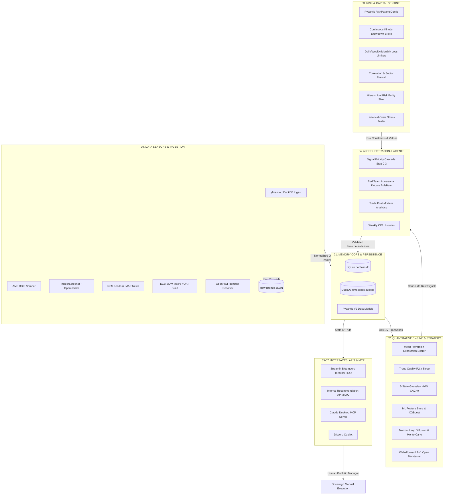

# PEA Pollux Systematic Engine — Architecture & Technical Specifications

> **Quantitative Decision Support Architecture for French PEA (Plan d'Épargne en Actions).**
> Strict Zero-Leverage, Continuous Kinetic Risk Governance, and Human Execution Sovereignty.

---

## 1. High-Level Architecture Overview



---

## 2. Directory & Layer Organization

| Directory | Layer Name | Core Responsibility | Key Modules & Classes |
|---|---|---|---|
| `00_data_sensors/` | **Data Layer** | Multi-source market data, insider filings, news scraping, macro spreads. | `market_prices_api.py`, `fundamentals_api.py`, `macro_alpha_api.py`, `insiders_api.py`, `raw_dumper.py`, `openfigi_mapper.py` |
| `01_memory_core/` | **Memory Core** | Immutable audit trails, database gateways, Pydantic contracts. | `sqlite_portfolio.py` (`PortfolioDB`), `duckdb_manager.py` (`TimeSeriesDB`), `data_models.py` (`Signal`, `Position`, `PortfolioState`) |
| `02_quant_engine/` | **Quant Engine** | Deterministic technical scoring, trend quality, HMM regime, ML features. | `technical_scorer.py` (`SignalGenerator`), `hmm_regime.py` (`HMMRegimeClassifier`), `ml_feature_store.py` (`FeatureStore`), `walk_forward_backtester.py`, `stochastic_models.py` |
| `03_risk_portfolio/` | **Risk Sentinel** | Capital preservation, drawdown circuit-breakers, kinetic sizing, HRP. | `risk_config.py` (`RiskParamsConfig`), `drawdown_breaker.py` (`DrawdownBreaker`), `correlation_firewall.py`, `hrp_sizer.py`, `stress_tester.py` |
| `04_orchestrator_ai/` | **AI Orchestrator** | Priority cascading, multi-agent red-team debate, post-mortems. | `signal_priority_cascade.py` (`SignalOrchestrator`), `red_team_agent.py` (`RedTeamDebateAgent`), `post_mortem_engine.py`, `news_sentiment_llm.py` |
| `05_interfaces/` | **User Interfaces** | Bloomberg HUD Streamlit command center, rich trade cards, Discord bot. | `terminal_dashboard.py`, `trade_cards.py`, `discord_copilot.py`, `llm_explainer.py` |
| `06_api/` | **Internal API** | Central FastAPI Single Source of Truth (SSOT). | `internal_api.py` (`app`) |
| `07_mcp/` | **MCP Server** | Model Context Protocol gateway for Claude Desktop & LLMs. | `pollux_mcp.py` (`get_portfolio_status`, `get_top_recommendations`, `analyze_asset`) |
| `config/` | **Configuration** | YAML configurations validated at runtime. | `risk_params.yaml`, `pea_universe.yaml`, `macro_calendar.yaml`, `earnings_calendar.yaml` |
| `tests/` | **Test Suite** | Comprehensive unit & regression test suites. | `test_institutional_suite.py`, `test_api_and_mcp.py`, `test_funnel_analytics.py` |
| `tools/` | **Developer Tools** | LLM context generator, universe synchronizers. | `build_llm_dump.py`, `sync_universe_from_bourso.py` |

---

## 3. Detailed Component Reference

### 3.1 Data Layer (`00_data_sensors/`)
- `FundamentalsSensor` (`fundamentals_api.py`): Calculates the 9-point Piotroski F-Score across profitability, leverage, liquidity, and operating efficiency. Caches results into `fundamentals_cache` SQLite table.
- `MacroAlphaSensor` (`macro_alpha_api.py`): Computes European VIX (`^V2TX` / `^VIX`), Put/Call ratios, and fetches the real-time 10Y OAT-Bund sovereign spread via the European Central Bank SDW REST API (`YC/B.U2.EUR.4F.G_N_A.SV_C_YM.SR_10Y`).
- `OpenFigiMapper` (`openfigi_mapper.py`): Resolves ISIN $\leftrightarrow$ FIGI $\leftrightarrow$ Ticker mappings with offline fallback and SQLite caching.
- `dump_bronze_json` (`raw_dumper.py`): Partitioned raw JSON archiver (`database/raw_bronze/{source}/{YYYY-MM-DD}/{timestamp}_{endpoint}.json`).

### 3.2 Memory Core (`01_memory_core/`)
- `PortfolioDB` (`sqlite_portfolio.py`): Thread-safe SQLite persistence gateway:
  - `account_state`: Account equity, cash buffer, last updated.
  - `positions`: Open positions (ticker, whole shares, avg entry price, current price, sector).
  - `audit_logs`: Immutable signal ledger with `lineage_json` feature snapshots.
  - `news_sentiment_history`: Historical news sentiment scores for time-series analysis.
  - `universe_snapshots`: Daily universe snapshots preventing survivorship bias.
  - `model_training_runs`: Provenance metadata for ML models.
  - `trade_post_mortems`: Retrospective post-mortem analysis records.
- `TimeSeriesDB` (`duckdb_manager.py`): Fast columnar time-series storage storing daily OHLCV bars for the entire PEA universe.

### 3.3 Quantitative Engine (`02_quant_engine/`)
- `SignalGenerator` (`technical_scorer.py`): Mean-Reversion Exhaustion generator:
  - Rule: $P_{\text{close}} > \text{SMA}_{200}$ (macro uptrend) AND $\text{RSI}_{14} < 30$ (oversold pull-back) AND $P_{\text{close}} > \text{SMA}_5$ (momentum stabilization) AND $\text{EPS} > 0$ (quality profitability).
  - Aegis Trend Quality boost: $+0$ to $+15$ pts calculated from linear regression $R^2 \times \text{slope}$.
- `HMMRegimeClassifier` (`hmm_regime.py`): 3-state Gaussian Hidden Markov Model fitted on CAC 40 (`^FCHI`) returns and realized volatility. Fail-safe defaults to `VOLATILE`.
- `FeatureStore` (`ml_feature_store.py`): Multi-factor feature engineering (RSI, ATR, Bollinger Band width, Volume Z-Score) with XGBoost Classifier and MAPIE Conformal Prediction calibration.
- `WalkForwardBacktester` (`walk_forward_backtester.py`): Realistic event-driven backtester executing strictly at **T+1 Open** with ATR 2.5x trailing stops and monthly 20% profit shaving.

### 3.4 Risk & Capital Sentinel (`03_risk_portfolio/`)
- `RiskParamsConfig` (`risk_config.py`): Strict Pydantic model (`extra="forbid"`, `frozen=True`) preventing configuration typos or invalid limits.
- `DrawdownBreaker` (`drawdown_breaker.py`):
  - Multi-horizon loss limits: Daily ($-0.5\%$), Weekly ($-2.0\%$), Monthly ($-5.0\%$).
  - Continuous Kinetic Brake Multiplier:
    $$\text{Kinetic Multiplier} = \begin{cases} 1.0 & \text{if } \text{DD} > -5\% \\ 0.50 & \text{if } -10\% < \text{DD} \le -5\% \\ 0.20 & \text{if } -15\% < \text{DD} \le -10\% \\ 0.0 & \text{if } \text{DD} \le -15\% \end{cases}$$
- `HRPSizer` (`hrp_sizer.py`): Hierarchical Risk Parity allocation using single-linkage hierarchical clustering on the covariance matrix.

### 3.5 AI Orchestration Layer (`04_orchestrator_ai/`)
- `SignalOrchestrator` (`signal_priority_cascade.py`): Executes the strict 7-stage risk cascade:
  0. Drawdown Breaker & Multi-Horizon Loss Circuit Breakers.
  0a. Conviction Floor (automatically elevated to 85 in `data_degraded_mode`).
  0b. Price Sanity Check.
  0c. VIX Panic Defense Veto ($> 30$).
  1. Macro Economic Calendar Veto.
  1b. Earnings / Dividend Blackout ($T \pm 3$ days).
  1c. Strict Piotroski Veto ($\text{Score} < 4$).
  1d. Max Simultaneous Satellite Positions.
  1e. Minimum Liquidity ADV Floor (€100,000/day).
  2a. Sector Concentration Firewall ($< 25\%$).
  2b. Pearson Correlation Firewall ($\rho < 0.70$).
  3. Half-Kelly $\times$ Inverse Volatility $\times$ Kinetic Multiplier Position Sizing.
- `RedTeamDebateAgent` (`red_team_agent.py`): 3-Agent Adversarial Debate:
  - *Bullish Quantitative Analyst*: Highlights upside catalysts and momentum.
  - *Bearish Risk Officer*: Challenges assumptions, highlights tail-risks and debt.
  - *Investment Committee Judge*: Synthesizes verdict (`GO`, `REDUCE_SIZE`, `NO_GO`).

### 3.6 APIs & MCP Layer (`06_api/` & `07_mcp/`)
- `internal_api.py` (FastAPI, port 8000):
  - `GET /api/v1/portfolio/summary`: Account metrics, exposure, holdings.
  - `GET /api/v1/recommendations/pending`: Active trade recommendations.
  - `GET /api/v1/data/ticker/{symbol}/context`: Unified deep-dive context.
  - `GET /api/v1/system/health`: Service health and database sizes.
- `pollux_mcp.py` (MCP FastMCP Server):
  - `get_portfolio_status()`: Natural language markdown portfolio summary.
  - `get_top_recommendations()`: Active quantitative ideas formatted for Claude Desktop.
  - `analyze_asset(ticker)`: Multi-factor technical and sentiment analysis.

---

## 4. Operational Commands (`Makefile`)

```bash
# Start FastAPI Internal Server
make api

# Start Claude Desktop MCP Server
make mcp

# Start Streamlit Bloomberg Terminal HUD
make dashboard

# Start Paris Market Scheduler Daemon
make scheduler

# Run Full Institutional Test Suite
make test

# Regenerate Monolithic & Domain-Specific LLM Dumps
make dump
```
