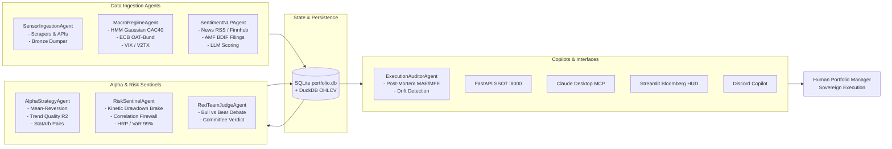

# PEA Pollux — Multi-Agent Architecture Blueprint & Development Proposal (Devis & Brainstorming)

> **Vision**: Evolving the PEA Pollux Systematic Terminal into a federation of specialized, decoupled, and autonomous Quantitative Agents. Each agent is responsible for an isolated quantitative discipline, exposing standardized JSON contracts to the Central API and Streamlit HUD.

---

## 1. Multi-Agent Federation Model (Decoupled Architecture)

---

## 2. Agent Catalog & Modular Specifications

### Agent 1: `SensorIngestionAgent` (Data Ingestion & Bronze Storage)
- **Role**: Continuous data extraction, validation, and anti-ban throttling.
- **Inputs**: Real-time quotes (yfinance), AMF BDIF filings, OpenInsider EU, InsiderScreener, RSS feeds.
- **Outputs**: Normalized OHLCV rows to DuckDB, raw JSON payloads to `database/raw_bronze/`, and insider records to `insiders_master`.
- **Decoupling**: Can be modified, restarted, or swapped with dedicated broker websockets (e.g. Interactive Brokers / Saxo Bank) without touching trading algorithms.

### Agent 2: `MacroRegimeAgent` (Macroeconomic & Regime Detection)
- **Role**: Continuously models systemic market risk and monetary conditions.
- **Inputs**: CAC 40 (`^FCHI`), Euro Stoxx 50 (`^STOXX50E`), ECB SDW yield curve API, European VIX (`^V2TX`).
- **Outputs**: 3-State Gaussian HMM regime (`BULL`, `BEAR`, `VOLATILE`), OAT-Bund spread (bps), and macroeconomic blackout windows.
- **Decoupling**: Runs as an isolated background task, publishing state to `system/regime` endpoint.

### Agent 3: `SentimentNLPAgent` (Financial NLP & Sentiment Scorer)
- **Role**: Converts unstructured text into bounded numeric sentiment scores $[-100, +100]$.
- **Inputs**: News headlines from Finnhub, Boursorama, Google News, and corporate disclosures.
- **Outputs**: Scored records in `news_sentiment_history`, daily rolling sentiment averages, breaking event alerts.
- **Decoupling**: Model-agnostic (supports OpenRouter Mistral, Local Ollama DeepSeek, or FinBERT).

### Agent 4: `AlphaStrategyAgent` (Factor Discovery & Signal Engine)
- **Role**: Evaluates quantitative mathematical setups.
- **Inputs**: OHLCV timeseries from DuckDB, Fundamental Piotroski metrics from SQLite.
- **Outputs**: Raw candidate signals with complete feature snapshots in `Signal.lineage`.
- **Modular Strategies**:
  - *Strategy A*: Mean-Reversion Exhaustion ($RSI_{14} < 30$ in uptrend).
  - *Strategy B*: Aegis Trend Quality Breakout ($R^2 \times \text{slope} > 0.35$).
  - *Strategy C*: Smart DCA Value Averaging on MSCI World (`CW8.PA`).

### Agent 5: `RiskSentinelAgent` (Capital Preservation & Kinetic Sizing)
- **Role**: Non-negotiable defense firewall protecting trading capital.
- **Inputs**: Candidate raw signals, current portfolio equity, drawdown history.
- **Outputs**: Sized approved recommendations or explicit structured vetoes.
- **Constraints**:
  - Multi-Horizon Drawdown Limits (Daily $-0.5\%$, Weekly $-2\%$, Monthly $-5\%$).
  - Dynamic Continuous Kinetic Multiplier ($1.0\times \rightarrow 0.50\times \rightarrow 0.20\times \rightarrow 0.0\times$).
  - Hierarchical Risk Parity (HRP) Half-Kelly position sizing.
  - Correlation Firewall ($\rho < 0.70$).

### Agent 6: `RedTeamJudgeAgent` (Adversarial Multi-Agent Debate)
- **Role**: Simulates an institutional investment committee debate before any signal is surfaced.
- **Debaters**:
  - **Bull Analyst**: Presents catalyst arguments, valuation upside, and momentum continuation.
  - **Bear Risk Officer**: Investigates balance sheet debt, regulatory risks, sector headwinds, and liquidity traps.
  - **Committee Judge**: Evaluates arguments and renders a final recommendation (`GO`, `REDUCE_SIZE`, `NO_GO`).

### Agent 7: `ExecutionAuditorAgent` (Trade Post-Mortem & Performance Attribution)
- **Role**: Automatically analyzes trade lifecycles upon position exit (stop-loss or profit-shave).
- **Metrics**: Maximum Adverse Excursion (MAE), Maximum Favorable Excursion (MFE), holding duration, slippage, and algorithmic lessons learned.
- **Outputs**: Structured records in SQLite `trade_post_mortems` table.

---

## 3. Work Breakdown & Phased Development Proposal (Devis)

| Phase | Milestone | Deliverables | Estimated Complexity |
|---|---|---|---|
| **Phase 1 (Done)** | **Foundational Architecture** | Pydantic contracts, SQLite portfolio, DuckDB OHLCV, Mean-reversion engine, Streamlit HUD. | High (Completed) |
| **Phase 2 (Done)** | **Capital Safety & Math** | Multi-horizon loss circuit breakers, Continuous Kinetic Brake, Piotroski veto, Cornish-Fisher VaR/CVaR, HMM CAC40. | High (Completed) |
| **Phase 3 (Done)** | **Internal API & MCP** | Central FastAPI Single Source of Truth (`06_api`), Claude Desktop MCP server (`07_mcp`), Bronze raw dumper. | Medium (Completed) |
| **Phase 4 (Next)** | **StatArb & Multi-Factor Extension** | Cointegration pairs trading on CAC40 components, FinBERT local sentiment model, automated Walk-Forward backtester dashboard tab. | Medium |
| **Phase 5 (Future)** | **Autonomous Multi-Agent Swarm** | Async message bus (Redis/NATS) connecting independent agent micro-services, real-time Discord voice/chat briefings. | High |

---

## 4. How External Developers / AI Agents Can Extend the Project

1. **Adding a New Data Source**:
   - Create a sensor in `00_data_sensors/my_sensor.py`.
   - Wrap raw API calls with `dump_bronze_json("my_source", endpoint, payload)`.
   - Add SQLite caching table in `01_memory_core/sqlite_portfolio.py` if needed.
2. **Adding a New Alpha Strategy**:
   - Create `02_quant_engine/my_strategy.py` subclassing `SignalGenerator`.
   - Ensure emitted `Signal` objects populate `lineage={...}` with feature snapshots.
   - Register the strategy in `main_scheduler.py`.
3. **Modifying Risk Limits**:
   - Update `config/risk_params.yaml`.
   - Strict Pydantic validation in `03_risk_portfolio/risk_config.py` guarantees type safety.
4. **Adding New API Endpoints & MCP Tools**:
   - Add endpoint in `06_api/internal_api.py`.
   - Expose corresponding tool function in `07_mcp/pollux_mcp.py`.
